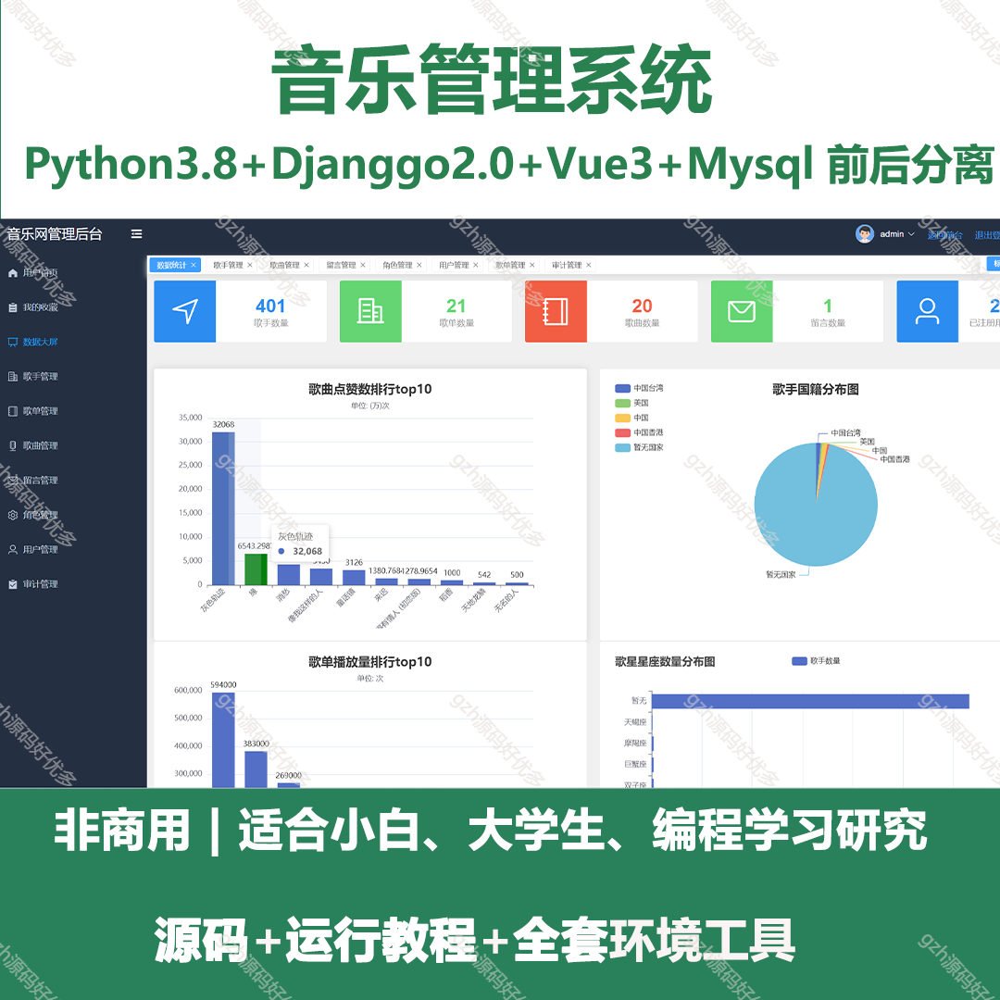
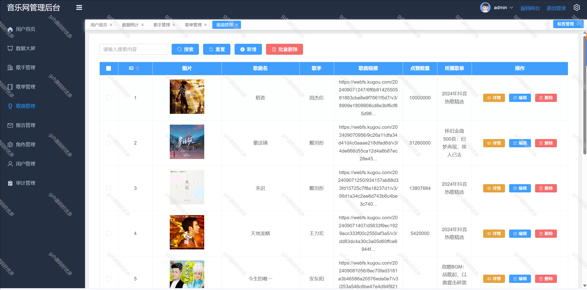
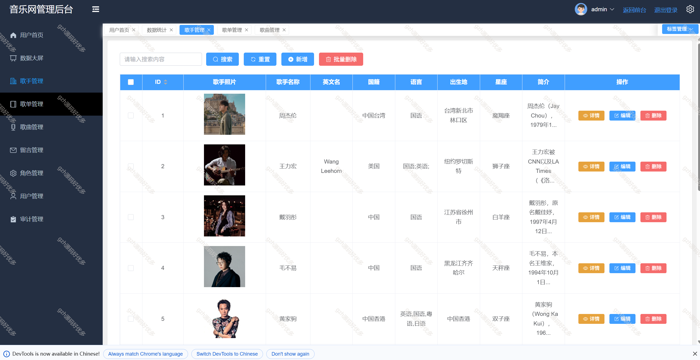
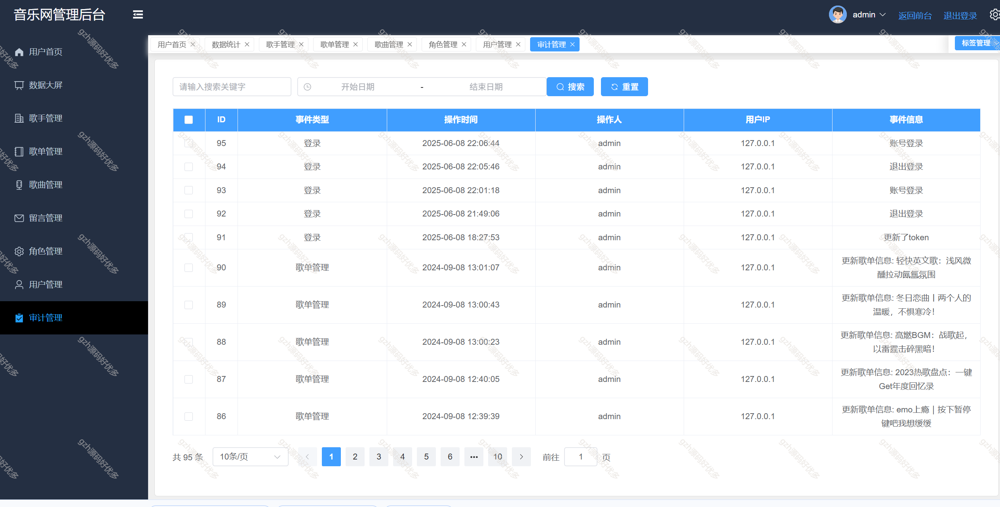
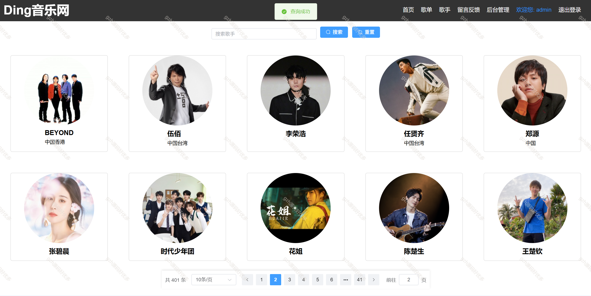

# python026
python026基于Python+Vue3的音乐管理系统
 
## 查看主页获取源码

### 一、关键词

音乐、歌曲，播放器管理系统

 

### 二、作品包含

源码+数据库+全套环境和工具资源+部署教程

 

### 三、项目技术

前端技术：Vue3 + pinia + Element Plus+Echarts+Axios
后端技术：Python3+Flask
  

 

### 四、运行环境（以下版本亲测，其他版本未知，请自测）

开发工具：PyCharm + VSCODE

数据库：MySQL8

数据库管理工具：Navicat10+

Python：Python3.8

前端Nodejs：18

浏览器：谷歌浏览器

 

### 五、项目介绍

项目编号：python026

音乐管理系统可实现音乐资源（歌曲、专辑、歌手等 ）的上传、分类、检索与播放控制，支持用户管理（注册、登录、权限 ）、播放列表及收藏管理，具备后台数据统计（播放量、用户偏好 ）等功能，助力音乐内容高效管理与用户便捷体验 。

管理员后台功能：
 首页大屏、和数据可视化展示
 歌单管理： 增删改查
 歌手管理： 增删改查
 歌曲管理： 增删改查
 留言管理： 增删查以及回复留言
 角色+权限管理： 增删改查，可自定义用户角色名称和权限
 用户管理： 增删改查
 运行日志和安全审计日志
 用户中心
 全局颜色方案修改

游客前台功能：
歌单推荐、歌手推荐、轮播图、收藏歌单、取消收藏（需要登录后才能收藏）、播放（暂停、下载）歌单或者歌手的音乐、留言反馈（需要登录后才能留言）、修改用户密码

 

### 六、运行截图

